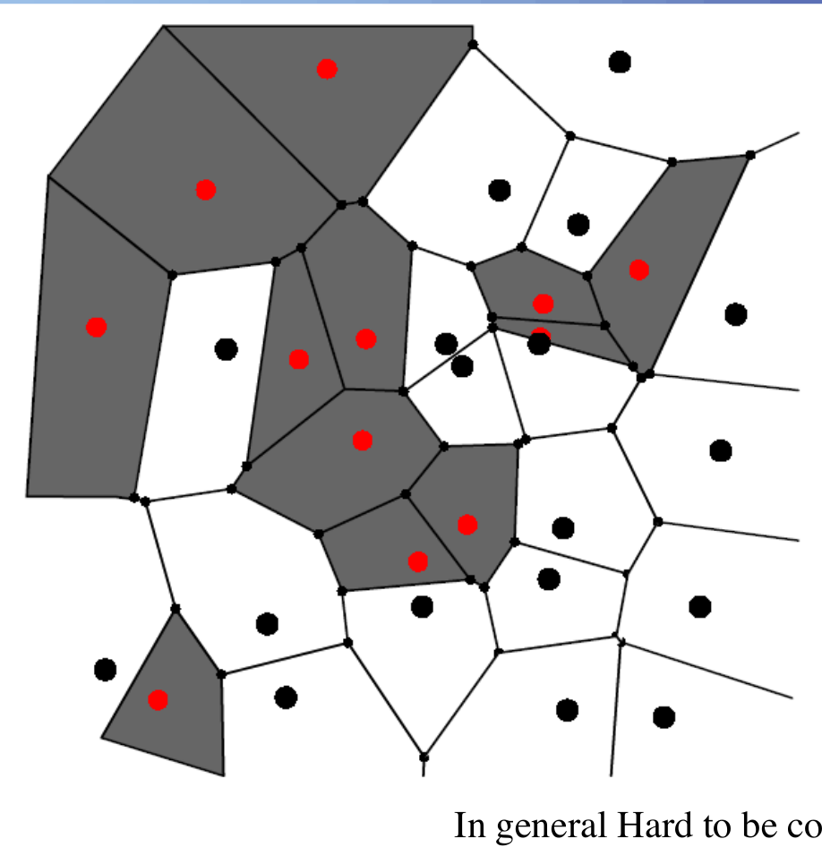
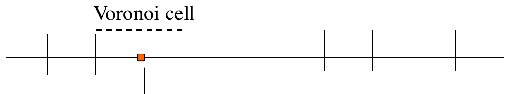
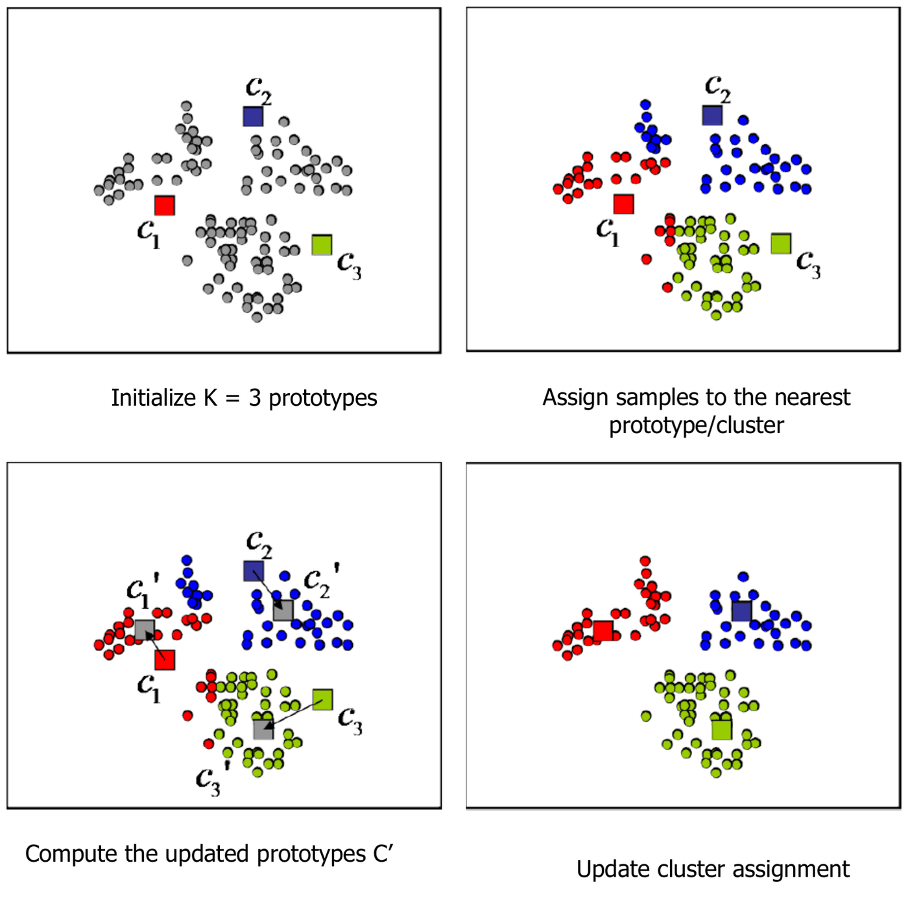
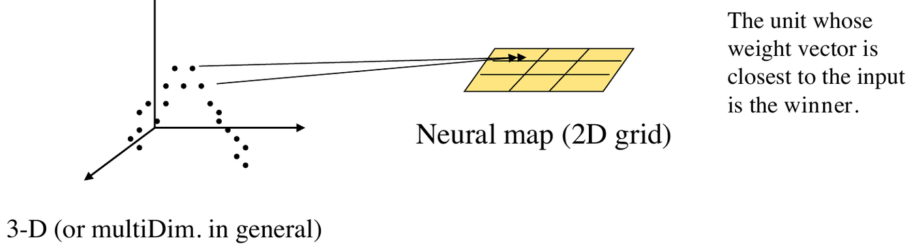
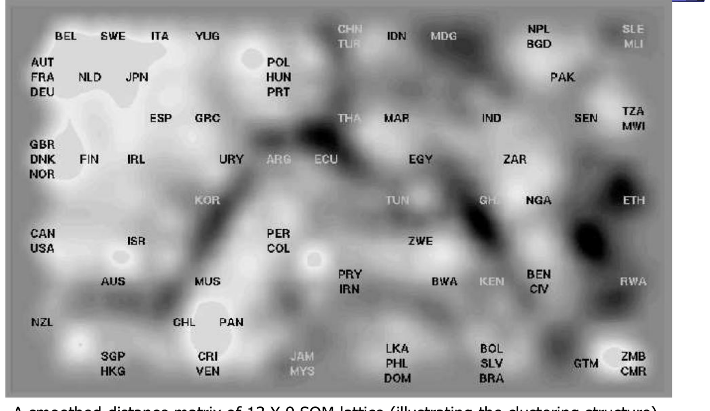
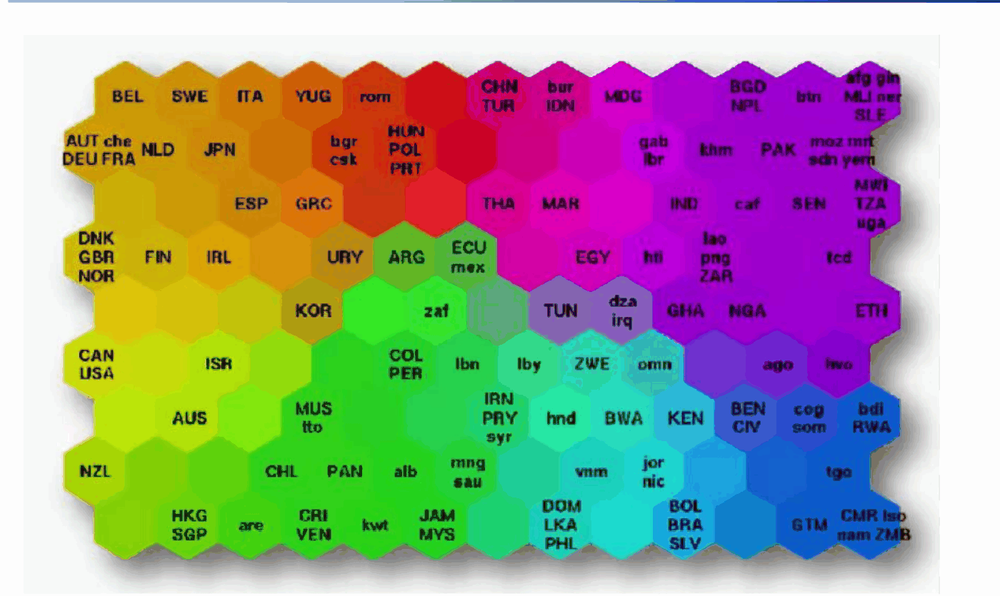

# Apprendimento non supervisionato: K-means e SOM

*Appunti di Fabio Piscitelli — Machine Learning (654AA), Prof. Alessio Micheli, Università di Pisa, a.a. 2024/25*

Questa lezione è un'introduzione leggera all'**apprendimento non supervisionato** con le reti neurali. Il fuoco è sul **clustering** visto come **quantizzazione vettoriale**: si parte dal classico **K-means** e si arriva a un modello neurale storico, le **Self-Organizing Map** (SOM) di Kohonen, che aggiungono al clustering la proprietà di preservare la topologia e quindi di visualizzare i dati.

## Apprendimento non supervisionato

Nell'apprendimento **non supervisionato non c'è insegnante**: il training set contiene solo dati **non etichettati** $\langle \mathbf{x}\rangle$. I task principali:

- **Clustering**: trovare raggruppamenti naturali nei dati.
- **Riduzione di dimensionalità**, visualizzazione, pre-elaborazione: i dati multidimensionali vengono proiettati in uno spazio a dimensione minore (PCA, Multi-Dimensional Scaling, Independent Component Analysis...).
- Modellazione della densità dei dati (non trattata nel corso).

A cosa serve? Esempi: organizzare le forme di vita in una tassonomia (cosa sono i mammiferi?); i neonati imparano a riconoscere (a "raggruppare") i volti familiari prima di capire il linguaggio. Soprattutto, i **dati non etichettati costano molto meno**: ad esempio 10 milioni di frame di YouTube hanno permesso risultati allo stato dell'arte nel riconoscimento di oggetti in 22.000 categorie.

### Clustering

> [!definition] Clustering
>
> Partizionare i dati in **cluster** (sottoinsiemi di dati "simili"): i pattern di un cluster sono più simili tra loro che a un pattern di un altro cluster. Ogni cluster è rappresentato da un **centroide** (detto anche prototipo, vettore di riferimento, centro del cluster, *codevector*; l'insieme dei centroidi è il **codebook**).

*Fig. 19.1 — Clustering: partizione dei dati in gruppi rappresentati da centroidi.*

Il clustering è stato affrontato in moltissimi contesti e discipline, con migliaia di algoritmi diversi: riflette la sua utilità come passo dell'analisi esplorativa dei dati. Qui si adotta la prospettiva della **quantizzazione vettoriale** per il **clustering partizionale**.

> [!warning] La metrica domina
>
> Come per il K-NN, è la **distanza assunta** a dire quali esempi sono simili, e l'algoritmo decide i raggruppamenti in base a quella metrica. La distanza euclidea è popolare ma è **solo una scelta**, e la scelta può avere implicazioni profonde (ad esempio si possono pesare di meno gli outlier usando $1 -$ una gaussiana centrata sul prototipo).

---

## Quantizzazione vettoriale

> [!definition] Vector Quantization (VQ)
>
> Le tecniche di quantizzazione vettoriale codificano una varietà di dati $V \subseteq \mathbb{R}^n$ usando solo un insieme finito $\mathbf{w} = (\mathbf{w}_1, \dots, \mathbf{w}_K)$ di vettori di riferimento (*codebook*) $\mathbf{w}_i \in \mathbb{R}^n$. Un vettore $\mathbf{x} \in V$ è descritto dal vettore di riferimento **vincente** (*best matching*) $\mathbf{w}_{i^*(\mathbf{x})}$, quello con distorsione $d(\mathbf{x}, \mathbf{w}_{i^*(\mathbf{x})})$ minima.

Questo divide la varietà in sottoregioni, i **poliedri di Voronoi**:
$$
V_i = \{\mathbf{x} \in V \;:\; \|\mathbf{x} - \mathbf{w}_i\| \le \|\mathbf{x} - \mathbf{w}_j\| \;\forall j\},
$$
e ogni $\mathbf{x}$ è descritto dal vettore di riferimento corrispondente.

*Fig. 19.2 — Diagramma di Voronoi: ogni cella contiene i punti più vicini al suo centro che a qualsiasi altro.*

Il nostro problema è il contrario di quello del K-NN: **dato il dataset, trovare i centri** che minimizzano la loss. In generale è difficile: trovare il codebook ottimo è **NP-completo**.

> [!example] Quantizzazione in 1D
>
> Nell'elaborazione digitale dei segnali, la **quantizzazione** approssima un intervallo continuo di valori (o un insieme molto grande di valori discreti) con un insieme relativamente piccolo di simboli discreti, commettendo un errore di quantizzazione (distorsione). È ciò che succede alla musica nei dispositivi digitali.
>
> 

**VQ e clustering.** Il clustering ha l'obiettivo più generale di trovare raggruppamenti **interessanti o utili**, dove "interessante" è spesso definito implicitamente dalla procedura stessa e non necessariamente dall'errore di quantizzazione minimo. Tuttavia la VQ fornisce un quadro utile, e i suoi algoritmi sono spesso usati per il clustering.

### L'errore di quantizzazione

L'obiettivo è partizionare in modo ottimo una distribuzione sconosciuta nello spazio degli input in regioni approssimate da prototipi: un insieme di quantizzatori $\mathbf{x} \mapsto c(\mathbf{x}) = \mathbf{w}_{i^*(\mathbf{x})}$, da uno spazio continuo a uno discreto. Si considera la **distorsione quadratica** $d(\mathbf{x}, c(\mathbf{x})) = \|\mathbf{x} - c(\mathbf{x})\|^2$; il suo valore medio sulla distribuzione degli input è la distorsione (o errore di ricostruzione, o di quantizzazione) attesa. **Questa è la nostra loss**:
$$
E = \int f\big(d(\mathbf{x}, \mathbf{w}_{i^*(\mathbf{x})})\big)\,p(\mathbf{x})\,d\mathbf{x} = \int \|\mathbf{x} - \mathbf{w}_{i^*(\mathbf{x})}\|^2\,p(\mathbf{x})\,d\mathbf{x},
$$
dove $p(\mathbf{x})$ è la distribuzione degli input. In versione discreta, su $l$ dati e $K$ prototipi:
$$
E = \sum_{i=1}^{l}\sum_{j=1}^{K}\|\mathbf{x}_i - \mathbf{w}_j\|^2\,\delta_{winner}(i, j), \qquad \delta_{winner}(i,j) = \begin{cases} 1 & \text{se } j \text{ è il vincitore per } \mathbf{x}_i \\ 0 & \text{altrimenti} \end{cases}
$$
($\delta_{winner}$ è la funzione caratteristica del campo recettivo di $\mathbf{w}_j$).

Minimizzare $E$ rispetto a $\mathbf{w}$ è il problema della VQ. Attenzione: l'integrando **non è differenziabile con continuità**, perché il vincitore $\mathbf{w}_{i^*(\mathbf{x})}$ cambia in modo discreto al variare di $\mathbf{x}$; si calcolano però le derivate **localmente**, fissando $\mathbf{x}$ in una cella di Voronoi.

---

## K-means

### Versione on-line

Derivando $E$ rispetto ai $\mathbf{w}_j$ si ottiene la regola di apprendimento della VQ, cioè il noto algoritmo **K-means** di Lloyd e MacQueen (versione on-line): per ogni $\mathbf{x}_i$,
$$
\Delta\mathbf{w}_{i^*} = \eta\,\delta_{winner}(i, i^*)\,(\mathbf{x}_i - \mathbf{w}_{i^*}).
$$
(La derivata di $\|\mathbf{x}_i - \mathbf{w}_j\|^2$ rispetto a $\mathbf{w}_j$ è $-2(\mathbf{x}_i - \mathbf{w}_j)$; muovendosi nel verso opposto al gradiente si avvicina $\mathbf{w}_j$ a $\mathbf{x}_i$.)

- Si modifica **solo il prototipo vincitore**, spostandolo verso $\mathbf{x}$.
- È una discesa del gradiente stocastica → **minimi locali**; il metodo dipende dall'**inizializzazione**.
- Il **numero di cluster** va fornito in anticipo.

### Versione batch

> [!abstract] Algoritmo K-means batch (Linde-Buzo-Gray, o Lloyd generalizzato)
>
> 1. Scegliere $K$ centri: $K$ pattern estratti a caso, o $K$ punti casuali nell'ipervolume che contiene i pattern.
> 2. Assegnare ogni pattern al centro più vicino (il **vincitore**):
> $$
> i^*(\mathbf{x}) = \arg\min_i \|\mathbf{x} - \mathbf{w}_i\|^2, \qquad \|\mathbf{x} - \mathbf{w}_i\|^2 = \sum_{j=1}^{n}(x_j - w_{ij})^2.
> $$
> 3. Ricalcolare i centri come **media** (centroide geometrico) dei membri del cluster:
> $$
> \mathbf{w}_i = \frac{1}{|\text{cluster}_i|}\sum_{\mathbf{x}_j \in \text{cluster}_i}\mathbf{x}_j.
> $$
> 4. Se il criterio di convergenza non è soddisfatto (nessuna o minima riassegnazione dei pattern, minima diminuzione dell'errore quadratico), tornare al passo 2.

(Esercizio: dalla versione on-line a quella batch. Sommando — o mediando — sui pattern di un cluster il delta on-line con $\eta = 1$, si ottiene $\mathbf{w}_{new} = \mathbf{w}_{old} + \frac{1}{|C|}\sum_{\mathbf{x} \in C}(\mathbf{x} - \mathbf{w}_{old}) = \frac{1}{|C|}\sum_{\mathbf{x} \in C}\mathbf{x}$: proprio la media.)

*Fig. 19.3 — Esempio di K-means con $K = 3$: inizializzazione, assegnazione, aggiornamento dei prototipi, nuova assegnazione.*

### Pregi e difetti

- È l'algoritmo più semplice e usato con un criterio d'errore quadratico; è popolare perché facile da implementare e in generale efficiente.
- Il numero $K$ di cluster va fornito.
- I minimi locali di $E$ rendono il metodo dipendente dall'inizializzazione, con scelte solo sub-ottime dei prototipi.
- Funziona molto bene per cluster **compatti e ipersferici**; con cluster di altre forme (ad esempio due "spirali" intrecciate) fallisce.
- **Nessuna proprietà di visualizzazione**: non permette di proiettare i dati in uno spazio a dimensione minore, e l'indicizzazione dei $\mathbf{w}$ è arbitraria, quindi la mappatura non è ordinata.

### Soft-max

Per evitare i minimi locali si introduce una regola di adattamento **soft-max**: non si modifica solo il vincitore, ma **tutti** i centri, in base alla loro **vicinanza** a $\mathbf{x}$, con un passo che decresce con la distanza $d(\mathbf{x}, \mathbf{w}_i)$ (ad esempio il *maximum-entropy clustering* con distanze gaussiane). Un'istanza di questa strategia nelle reti neurali sono le **SOM di Kohonen**, dove però la vicinanza tra i vettori di riferimento è definita su una **mappa ordinata**, cioè una griglia neurale su cui sono disposti.

---

## Self-Organizing Map

Le **Self-Organizing Map** (SOM), o **mappe di Kohonen** (1981), sono reti di $N$ neuroni disposti su una **griglia regolare a bassa dimensione** (di solito 2D, un *lattice*).

- Ogni unità è identificata dalle sue **coordinate** sulla mappa.
- Ogni unità riceve **lo stesso input** $\mathbf{x}$.
- Ogni unità ha un **peso** $\mathbf{w}$, con $\dim(\mathbf{w}) = \dim(\mathbf{x}) = n$.

### Obiettivo

La SOM impara una mappa dallo spazio degli input a un reticolo di unità neurali che **preserva la topologia**:

- unità vicine sulla mappa rispondono a pattern di input simili;
- punti vicini nello spazio di input vengono mappati sulla stessa unità o su unità vicine;
- la mappa di output (2D) ha proprietà di **visualizzazione**.

*Fig. 19.4 — Una SOM mappa lo spazio di input (qui 3D) su una griglia neurale 2D.*

Usi della SOM:

- **clustering**: i cluster si identificano sulla mappa (si trovano rapidamente strutture nei dati);
- **pattern recognition e VQ**: l'input viene trasformato nel vettore dei pesi del neurone più vicino (il vettore del codebook);
- **compressione**: l'input viene trasformato nell'indice (codice) dell'unità vincitrice;
- **proiezione ed esplorazione**: la distribuzione dei dati multidimensionali si visualizza in uno spazio a dimensione minore (la mappa 2D).

### Apprendimento competitivo e ispirazione biologica

L'**apprendimento competitivo** è un processo adattivo in cui i neuroni diventano gradualmente sensibili (specializzati) a categorie o insiemi di input diversi: i neuroni **competono** per un dato, e il vincitore apprende di più.

La natura sfrutta questo meccanismo: nella **corteccia somatosensoriale** (e motoria) c'è una mappa **topologicamente ordinata** del corpo, l'**homunculus**. Neuroni adiacenti rappresentano sorgenti di attivazione vicine nel corpo, e le parti più sensibili occupano aree più ampie della corteccia. In una mappa che preserva la topologia, unità fisicamente vicine rispondono a classi di input a loro volta vicine.

*Fig. 19.5 — L'homunculus: una mappa topologicamente ordinata del corpo nella corteccia.*

### L'algoritmo

> [!abstract] Algoritmo SOM
>
> - Inizializzare casualmente i pesi della mappa.
> - Estrarre un input $\mathbf{x}$.
> - **Fase competitiva**: il vincitore è l'unità con $\mathbf{w}$ più simile a $\mathbf{x}$.
> - **Fase cooperativa**: aggiornare i pesi delle unità che hanno relazioni topologiche **sulla mappa** con il vincitore (una forma di soft-max).
> - Continuare fino a convergenza (nessun cambiamento).
>
> **Fattore chiave**: i vicini **sulla mappa** (mentre il soft-max standard usa la vicinanza nello spazio dei dati).

#### Fase competitiva

L'input $\mathbf{x}$ viene confrontato con i pesi di tutte le unità con la distanza euclidea. La SOM standard adotta una strategia **winner-take-all** (come il K-means):
$$
i^*(\mathbf{x}) = \arg\min_i \|\mathbf{x} - \mathbf{w}_i\|,
$$
dove $i$ è un indice sulla mappa (ad esempio le coordinate 2D).

#### Fase cooperativa

I pesi del vincitore **e delle unità del suo vicinato** vengono avvicinati all'input (apprendimento hebbiano). All'iterazione $t$:
$$
\mathbf{w}_i(t+1) = \mathbf{w}_i(t) + \eta(t)\,h_{i,i^*(\mathbf{x})}(t)\,\big[\mathbf{x} - \mathbf{w}_i(t)\big],
$$
dove $h$ è la **funzione di vicinato** (*neighborhood kernel*), che decresce monotonamente all'aumentare della distanza **sulla mappa** tra l'unità $i$ e il vincitore. Ad esempio una gaussiana:
$$
h_{i,i^*}(t) = \exp\left(-\frac{\|\mathbf{r}_i - \mathbf{r}_{i^*}\|^2}{2\sigma^2(t)}\right),
$$
con $\mathbf{r}_i$ le coordinate dell'unità $i$ sulla griglia e $\sigma(t)$ la larghezza.

Il **learning rate** $\eta$ e il **raggio del vicinato** $\sigma$ diminuiscono con le iterazioni: il vicinato è **ampio all'inizio** (ordinamento globale della mappa) e poi si restringe lentamente durante l'apprendimento (convergenza, raffinamento locale). In pratica la forma del vicinato si sceglie tra forme geometriche standard sulla griglia (rettangolare, esagonale...) che includono un insieme finito di unità.

### L'emergere dell'ordine topologico

La regola della fase cooperativa è **fondamentale** per la formazione di mappe topograficamente ordinate. I pesi non vengono modificati indipendentemente, ma **per sottoinsiemi topologicamente legati**: a ogni passo si seleziona il vicinato del vincitore sulla griglia, e tutte le unità del sottoinsieme ricevono aggiornamenti simili. Così l'informazione topologica viene trasmessa alla mappa: il vincitore e i suoi vicini sulla griglia ricevono aggiornamenti simili e, dopo l'apprendimento, rispondono a input simili. Anche se sembra naturale, una dimostrazione formale dell'ordinamento è difficile.

> [!tip] K-means contro SOM
>
> - **K-means**: aggiorna solo il vincitore; i prototipi non hanno alcun ordine; non c'è visualizzazione.
> - **SOM**: aggiorna il vincitore **e i suoi vicini sulla griglia**, con un vicinato che si restringe nel tempo; i prototipi sono disposti su una mappa ordinata che **preserva la topologia**, permettendo la visualizzazione; il vicinato ampio iniziale aiuta anche a evitare i minimi locali. (Con vicinato di raggio zero, la SOM si riduce al K-means on-line.)

*Fig. 19.6 — Addestramento di una SOM su dati uniformi in 2D: i vettori di riferimento (collegati secondo la griglia) si distendono progressivamente sulla distribuzione.*

Durante l'addestramento le unità "vanno a rappresentare" i cluster dei dati.

### Visualizzazione

La mappa si può usare per visualizzare diverse caratteristiche della SOM e dei dati:

- la **densità** dei vettori di riferimento (colore proporzionale al numero di "hit");
- le **distanze** tra i prototipi di unità vicine (**U-matrix**): colori scuri indicano grandi distanze tra unità adiacenti, colori chiari piccole distanze;
- le mappe di Sammon (con linee)...

Questo rende la SOM facilmente **interpretabile**.

> [!example] Welfare e povertà nel mondo (Kaski e Kohonen, 1995)
>
> 39 indicatori di benessere per 77 paesi (World Development Report 1992). Sulla mappa 13×9, il grigio tra due unità indica la distanza (scalata e smussata) tra i loro vettori di riferimento: le zone chiare sono cluster di paesi simili, le zone scure i confini tra cluster. Non serve alcuna ipotesi a priori sulla forma dei cluster.
>
> 
>
> 

---

## Valutare un clustering (cenni)

Come si valuta il risultato di un clustering? Cosa distingue un risultato buono da uno scadente?

- La valutazione è spesso **soggettiva**: esistono pochi "gold standard", tranne in sotto-domini ben definiti.
- Misure **oggettive**, come l'errore di quantizzazione (che però dipende dal numero di centroidi).
- **Non** si usa banalmente l'etichetta di un task di classificazione sottostante (la *purity*, con entropia, informazione mutua...): se si hanno le etichette, tanto vale usare un classificatore.
- Qualità del modello/clustering contro qualità dei risultati (dipendente dal dominio).

Altri argomenti dell'apprendimento non supervisionato: clustering gerarchico (dendrogrammi), analisi delle componenti principali (e di curve e superfici principali), regole di associazione, ICA, Multidimensional Scaling, t-SNE, Generative Topographic Mapping, reti ART.

> [!question] Possibili domande d'esame
>
> - Definire clustering e quantizzazione vettoriale. Cos'è l'errore di quantizzazione?
> - Derivare la regola on-line del K-means e passare alla versione batch.
> - Pregi e difetti del K-means.
> - Descrivere la SOM: architettura, fase competitiva, fase cooperativa, funzione di vicinato.
> - Perché la SOM preserva la topologia? Differenze tra K-means e SOM.
> - Come si visualizza una SOM (U-matrix)?
