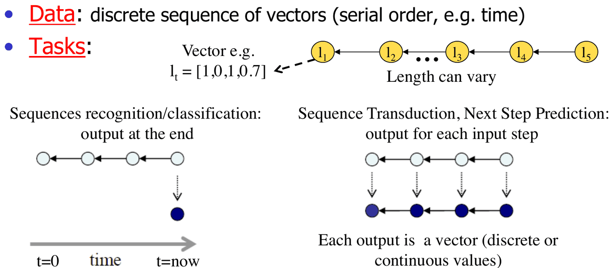
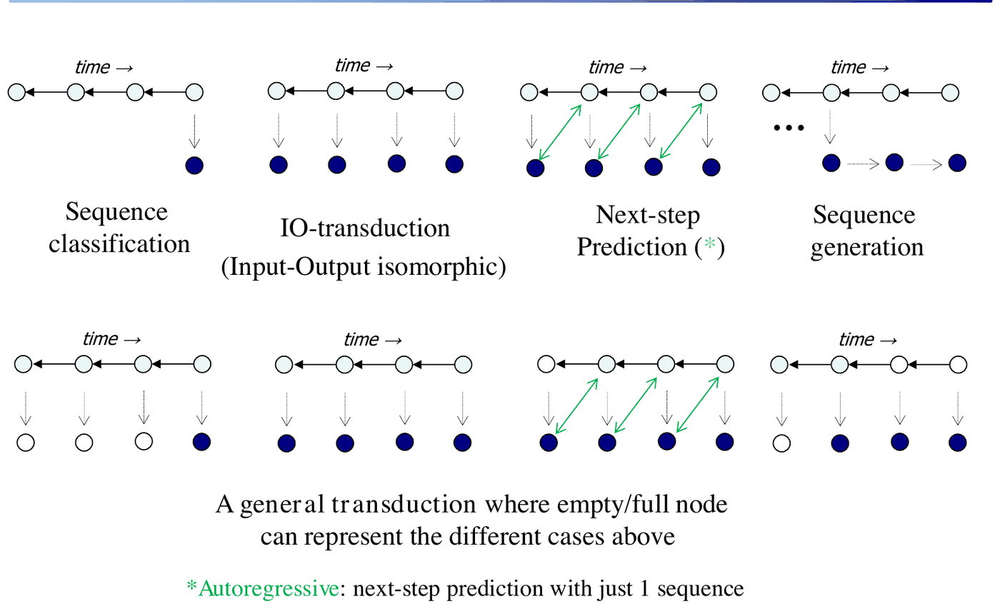
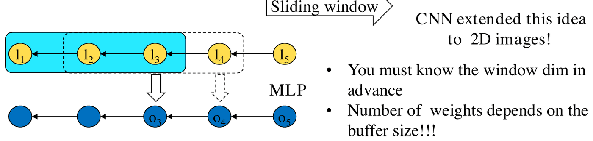
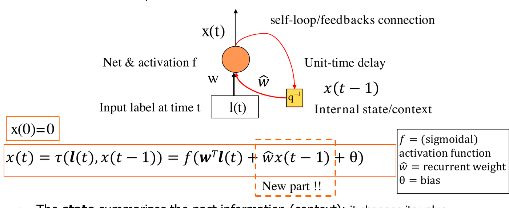
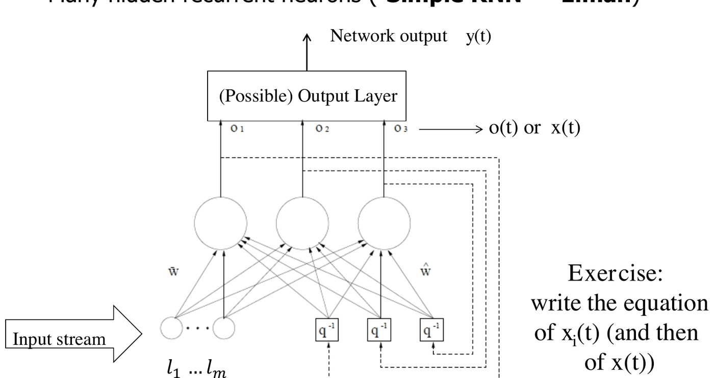
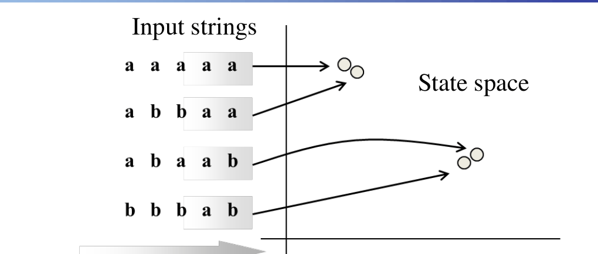
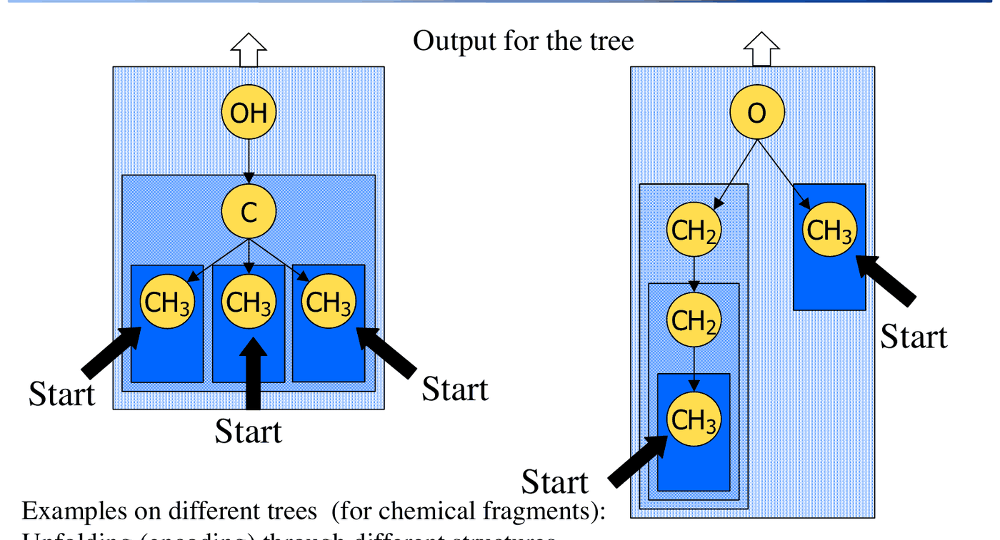

# Reti neurali ricorrenti (RNN)

*Appunti di Fabio Piscitelli — Machine Learning (654AA), Prof. Alessio Micheli, Università di Pisa, a.a. 2026/27*

Questa è un'introduzione leggera alle **reti neurali ricorrenti** (RNN), che saranno approfondite nei corsi ISPR e CNS. Finora le reti erano **feedforward** (direzione input → output) e lavoravano su **vettori**. Le RNN aggiungono **connessioni di feedback** (cicli) nella topologia: la presenza di auto-connessioni dà alla rete **proprietà dinamiche** e una **memoria** (uno stato) delle computazioni passate. Questo estende la capacità rappresentativa del modello all'elaborazione di **sequenze** (e di dati strutturati). Le RNN sono anche biologicamente plausibili: le reti neurali biologiche sono ricorrenti.

## Perché i dati sequenziali

Servono modelli per sequenze quando l'uscita dipende dalla **storia degli input** (ad esempio nel tempo: modelli dinamici), o quando il dominio è fatto di **sequenze di lunghezza variabile**:

- processi dinamici, elaborazione di segnali (filtri, controllo), robotica;
- **linguaggio**: riconoscimento del parlato, NLP, linguaggi formali, information retrieval;
- visione e ragionamento su eventi temporali;
- **serie temporali**: previsioni finanziarie, elaborazione di segnali;
- genomica e proteomica (bioinformatica): ad esempio predire la struttura di una proteina dalla sequenza di amminoacidi;
- riconoscimento di attività umane da dati di sensori.

Le RNN (e gli approcci collegati) sono state il riferimento per l'elaborazione di sequenze, con risultati allo stato dell'arte nel **riconoscimento del parlato** e nell'**elaborazione del testo** (traduzione automatica...), ma anche per applicazioni "divertenti" come la composizione musicale e la generazione di testo e parlato.

## Dai dati piatti ai dati strutturati

Finora i dati erano **piatti** (vettori). I dati **strutturati** sono sequenze, alberi, grafi, dati multi-relazionali: stringhe, proteine, serie temporali, piccole molecole, reti.

### Il nuovo dominio: sequenze e trasduzioni

- **Dati**: sequenze discrete di **vettori** (con un ordine seriale, ad esempio il tempo), di lunghezza variabile. Ogni elemento $\mathbf{l}_t$ è un vettore (es. $\mathbf{l}_t = [1, 0, 1, 0{,}7]$).
- **Task**: una **trasduzione** nel dominio sequenziale, cioè una mappatura *sequenza di input → valore o sequenza di output*.

*Fig. 20.1 — Riconoscimento/classificazione di sequenze (uscita alla fine) e trasduzione di sequenze (uscita a ogni passo).*

*Fig. 20.2 — Tipi di trasduzione: classificazione di sequenze, trasduzione IO isomorfa (un'uscita per ogni input), predizione del passo successivo, generazione di sequenze. La predizione autoregressiva usa una sola sequenza.*

---

## La memoria nelle reti neurali

L'obiettivo è che l'uscita dipenda dagli input **precedenti**.

### Approccio 1: memoria finita (IDNN)

Il primo approccio è "spaziale", a **memoria finita**: le **Input Delay Neural Network** (nella classe delle *Time-Delay NN*, già viste all'inizio delle CNN). I ritardi sono nelle connessioni e fanno da memoria dell'input: un **registro a scorrimento** di dimensione finita, una **finestra scorrevole** sulla sequenza. (Le CNN hanno esteso questa idea alle immagini 2D.)

*Fig. 20.3 — IDNN: una finestra scorrevole di dimensione fissa sulla sequenza, elaborata da un MLP.*

- La dimensione della finestra va **nota in anticipo**.
- Il numero di pesi **dipende dalla dimensione del buffer**.
- Se il buffer contiene abbastanza informazione, si risolve il problema con un normale addestramento di MLP (ad esempio NETtalk, 1988).

### Approccio 2: unità ricorrenti

Un'**unità neurale ricorrente** ha una connessione di feedback (un *self-loop*) e usa sia l'input corrente sia l'informazione di **stato**:
$$
x(t) = \tau\big(\mathbf{l}(t), x(t-1)\big) = f\big(\mathbf{w}^T\mathbf{l}(t) + \hat{w}\,x(t-1) + \theta\big), \qquad x(0) = 0,
$$
dove $\mathbf{l}(t)$ è l'input (etichetta) al tempo $t$, $f$ è l'attivazione (sigmoidale), $\hat{w}$ è il **peso ricorrente**, $\theta$ il bias, e $x(t-1)$ è lo stato al passo precedente, fornito da un ritardo unitario $q^{-1}$. La parte nuova rispetto a un neurone normale è il termine $\hat{w}\,x(t-1)$.

*Fig. 20.4 — Un'unità ricorrente: il self-loop con ritardo unitario porta lo stato precedente come input aggiuntivo.*

- Lo **stato** riassume l'informazione passata (il **contesto**): cambia valore seguendo il flusso degli input.
- La **codifica del passato è adattiva**, perché dipende dai pesi liberi del modello.

> [!example] Esercizio: contare gli "1"
>
> Realizzare una RNN con una sola unità (trovando i valori di $w$ e $\hat w$) che restituisca il numero di "1" ricevuti finora in una sequenza di 0 e 1.
>
> **Soluzione**: unità lineare con $w = 1$, $\hat w = 1$, $\theta = 0$, cioè $x(t) = l(t) + x(t-1)$. Con l'input $1, 0, 1, 1, 0, 1$ lo stato vale $1, 1, 2, 3, 3, 4$: **lo stato accumula la somma degli "1"** ricevuti. La RNN riassume l'informazione della sotto-sequenza passata, cosa che una IDNN **non può fare** per sequenze di lunghezza variabile (la sua memoria è limitata alla finestra).

### Sistemi a transizione di stato

In generale, un modello ricorrente è un **sistema a transizione di stato**:
$$
\begin{cases} \mathbf{x}(t) = \tau\big(\mathbf{x}(t-1), \mathbf{l}(t)\big) \\ \mathbf{y}(t) = g\big(\mathbf{x}(t), \mathbf{l}(t)\big) \end{cases} \qquad \mathbf{x}(0) = \mathbf{0}.
$$

*Fig. 20.5 — Sistema a transizione di stato: lo stato al tempo $t$ codifica (è un *embedding* di) tutta la sotto-sequenza fino a $t$.*

- $\tau$ è la **funzione di transizione di stato** (*next-state function*), realizzata da una rete neurale.
- Lo stato riassume gli input passati: è una **codifica** (embedding) delle sotto-sequenze.
- Lo stato ha valori **continui** (reali) (a differenza, ad esempio, degli automi o degli HMM, che hanno stati discreti).
- $\mathbf{x}(t)$ può essere un insieme di stati, per comporre una rete di unità ricorrenti.

### Una rete ricorrente (Simple RNN)

Con molte unità ricorrenti nascoste si ottiene la **Simple RNN** di Elman: ogni unità nascosta riceve l'input e gli stati precedenti di **tutte** le unità nascoste (attraverso i ritardi), e uno strato di uscita (eventuale) produce $\mathbf{y}(t)$.

*Fig. 20.6 — Una Simple RNN (Elman) con più unità ricorrenti nascoste.*

> [!example] Esercizio: le equazioni
>
> Per l'unità nascosta $i$:
> $$
> x_i(t) = f\left(\sum_{j=1}^{m} w_{ij}\,l_j(t) + \sum_{k} \hat w_{ik}\,x_k(t-1) + \theta_i\right),
> $$
> e in forma vettoriale $\mathbf{x}(t) = f\big(W\mathbf{l}(t) + \hat W\mathbf{x}(t-1) + \boldsymbol{\theta}\big)$.

### Proprietà

Anche la semplice RNN è già molto potente:

- è un **approssimatore universale** di sistemi dinamici non lineari;
- è **Turing-equivalente** (può simulare qualunque automa);
- è un sistema dinamico non lineare (non autonomo), studiabile con la teoria dei sistemi dinamici (caos, frattali...).

I modelli ricorrenti si basano su tre assunzioni:

- **Causalità**: l'uscita al tempo $t_0$ dipende solo dagli input ai tempi $t \le t_0$. È necessaria e sufficiente per avere uno stato interno.
- **Stazionarietà**: invarianza nel tempo (dopo l'addestramento): la funzione di transizione $\tau$ è **la stessa** in ogni istante, indipendentemente dalla lunghezza delle sequenze. È ciò che permette di elaborare dati di lunghezza variabile con un modello di dimensione fissa.
- **Adattività**: le funzioni di transizione sono realizzate da reti neurali con pesi liberi, quindi **apprese dai dati**.

---

## Apprendimento: l'unfolding

Si **srotola** (*unfolding*) nel tempo lo stesso modello lungo la sequenza di input: si costruisce un MLP feedforward (la **rete di codifica**, *encoding network*) equivalente alla RNN sui $k$ passi della sequenza, con **una replica del modello per ogni passo**. Per la stazionarietà, le repliche **condividono i pesi**.

*Fig. 20.7 — Unfolding di una RNN a 2 unità su 3 passi di input: si ottiene una rete feedforward a molti strati, diversa per ogni sequenza di input.*

> [!tip] Il punto chiave
>
> Sulla rete di codifica srotolata si può applicare la **backpropagation**! Si ottiene una rete diversa per ogni sequenza di input, con **molti strati** (tanti quanti i passi): è di fatto una rete **profonda**, con pesi condivisi tra gli strati.

Gli algoritmi di apprendimento supervisionato per RNN devono tenere conto di tutte le transizioni di codifica sviluppate dal modello a ogni passo:

- **BPTT** (*Back-Propagation Through Time*);
- **RTRL** (*Real-Time Recurrent Learning*).

Calcolano in modo diverso lo stesso gradiente degli errori di uscita sulla rete srotolata equivalente.

> [!warning] Dipendenze a lungo termine
>
> Poiché la rete srotolata è molto profonda, il **vanishing gradient** rende difficile apprendere **dipendenze a lungo termine** (quando l'uscita dipende da input molto lontani nel passato).

### Modelli avanzati

È un campo di ricerca in rapida crescita, con molte varianti:

- **LSTM** (*Long Short-Term Memory*): cercano di risolvere il vanishing gradient con **unità "gate"** capaci di selezionare il flusso del passato e del gradiente. Sono nate per le dipendenze **lunghe**: non sono adatte a serie brevi, quindi, nonostante la popolarità, non vanno usate acriticamente;
- **GRU** (*Gated Recurrent Units*): una LSTM semplificata;
- **BRNN** (RNN bidirezionali): considerano sia il contesto a sinistra sia quello a destra;
- spesso si fondono reti profonde e RNN;
- contro il vanishing gradient: ottimizzatori Hessian-free, tecniche di pre-training...

Sono incluse nelle principali librerie (PyTorch, Keras, Matlab...). Alcuni dati sulla loro diffusione: nel 2015 le LSTM erano usate in 2 miliardi di telefoni Android e 1 miliardo di iPhone (Siri); nel 2016 quasi il 30% della potenza di calcolo per l'inferenza dei datacenter di Google era usato per le LSTM; nel 2017 erano in Alexa e in Facebook (30 miliardi di traduzioni a settimana). Un esempio curioso: generare la versione **manoscritta** di un testo predicendo un punto $(x,y)$ della traiettoria della penna alla volta (Graves, 2013).

---

## Approcci collegati

- SOM e reti non supervisionate per domini sequenziali.
- **Hidden Markov Model** (modellano la distribuzione di probabilità delle transizioni di stato).
- **Transformer**.
- **RNN randomizzate**: il **Reservoir Computing** (ESN, *Liquid State Machine*).
- Modelli basati su distanze (string matching), kernel per stringhe, inferenza grammaticale, ILP.

### Transformer e attenzione

Un **transformer** (2017) è un'architettura di deep learning basata sul meccanismo di **attenzione multi-head** in parallelo. L'attenzione permette al modello di **accedere a qualunque punto precedente** della sequenza; encoder e/o decoder più reti feedforward completano l'architettura per scopi diversi.

Lo **strato di attenzione** pesa tutti gli stati precedenti secondo una misura di **rilevanza appresa**, fornendo potenzialmente informazione anche su token molto lontani. Si è rivelato particolarmente utile nella traduzione, dove un contesto lontano può essere essenziale per il significato di una parola. Usato prima per migliorare le RNN, poi anche da solo (*"Attention is all you need"*). Tutti i token vengono elaborati **simultaneamente**, calcolando pesi tra le loro rappresentazioni (embedding) in strati successivi: sono semplicemente unità a **prodotto scalare scalato** tra vettori *query* e vettori delle parole, che cercano le correlazioni più alte tra le parole di una frase (ad esempio in "see that girl", "that" viene associato a "girl"). Si applica anche a *patch* di immagini invece che a parole (*vision transformer*).

### Reti ricorrenti randomizzate: le Echo State Network

Possiamo sfruttare direttamente questa macchina a stati per codificare le sequenze, e poi usare l'embedding risultante per imparare la mappatura di uscita? Sì, **anche con reti ricorrenti connesse casualmente con pesi fissi** (non addestrati)! È la classe del **Reservoir Computing** (RC): Echo State Network, *liquid state machine*, *fractal machine* (si veda [[18 - Reti neurali randomizzate]]).

*Fig. 20.8 — Una Echo State Network: reservoir casuale non addestrato e readout lineare addestrato.*

> [!definition] Echo State Network (ESN)
>
> Una ESN è composta da:
> - un grande **reservoir** di unità ricorrenti connesse in modo sparso, **non addestrate** dopo un'inizializzazione casuale;
> - un semplice **readout** feedforward di unità **lineari**, addestrato con metodi lineari efficienti (es. **ridge regression**).
>
> **Echo State Property**: la funzione di transizione di stato deve essere **contrattiva** (si limita il raggio spettrale dei pesi del reservoir, cioè si garantisce la stabilità del sistema dinamico). Così lo stato ricorrente dipende asintoticamente (come un'"eco") **solo dalla storia degli input**, e non dalle condizioni iniziali dello stato.

Le ESN sono **molto efficienti** (nessun addestramento delle unità ricorrenti) e risolvono bene i task sotto certe condizioni.

#### Organizzazione markoviana dello spazio degli stati

*Fig. 20.9 — Il reservoir proietta le sequenze nello spazio degli stati in modo "markoviano": sequenze con lo stesso suffisso finiscono vicine.*

Il reservoir agisce come una **proiezione** (embedding) delle sequenze di input nel vettore degli stati $\mathbf{x}(t)$, e riesce intrinsecamente a **discriminare le sequenze in base al suffisso**, senza addestrare i pesi ricorrenti: gli stati sono tanto più vicini quanto più è lungo il **suffisso comune** (gli input recenti contano di più, per la contrattività). Questo rende facile apprendere task **markoviani** (anche per le RNN addestrate, ma le ESN sono molto più efficienti), ed è un **bias architetturale** che vale anche per i modelli ricorrenti con apprendimento (Gallicchio, Micheli, 2011).

**Reservoir Computing profondo.** Si possono impilare più reservoir (**DeepESN**, con molti risultati del gruppo CIML di Pisa), unendo la potenza delle RNN profonde all'efficienza delle ESN. L'organizzazione a strati mostra vantaggi in termini di **scale temporali multiple** e di **ricchezza delle dinamiche**: nell'analisi in frequenza, gli strati più alti si concentrano sulle frequenze più basse (scale temporali più ampie), formando una rappresentazione temporale gerarchica.

---

## Verso i domini strutturati

Si può estendere l'approccio ricorrente agli **alberi**? Sì: le **reti neurali ricorsive** (RecNN). La codifica procede **dal basso verso l'alto** (dalle foglie alla radice), e lo stato di ogni vertice dipende dal suo label e dagli stati dei **figli** (estendendo la funzione di transizione a più stati).

*Fig. 20.10 — Modello grafico per alberi e unfolding della codifica lungo la struttura: se la struttura dell'albero cambia, la codifica cambia di conseguenza.*

*Fig. 20.11 — Una rete ricorsiva applicata ad alberi diversi (frammenti chimici): le unità sono le stesse per tutti i vertici di un albero e per tutti gli alberi del dataset (condivisione dei pesi).*

> [!abstract] Sintesi
>
> Le RNN aggiungono **stati** e **feedback** alle reti, diventando **sistemi a transizione di stato** capaci di elaborare sequenze di lunghezza variabile. Si basano su causalità, stazionarietà e adattività; si addestrano **srotolandole** nel tempo e applicando la backpropagation (BPTT, RTRL), ma soffrono di **vanishing gradient** sulle dipendenze lunghe (da cui LSTM e GRU). Alternative e sviluppi: transformer (attenzione), Echo State Network (reservoir casuale + readout lineare, con un bias markoviano), reti ricorsive per alberi e grafi.

> [!question] Possibili domande d'esame
>
> - Perché servono modelli per dati sequenziali? Cos'è una trasduzione?
> - Differenza tra IDNN e RNN; perché una IDNN non può contare gli "1" in sequenze arbitrarie?
> - Scrivere l'equazione di un'unità ricorrente e di una Simple RNN.
> - Quali sono le assunzioni di causalità, stazionarietà e adattività?
> - Cos'è l'unfolding e come permette di usare la backpropagation?
> - Cos'è una Echo State Network e cos'è la Echo State Property?
> - Come si estendono le RNN agli alberi?
