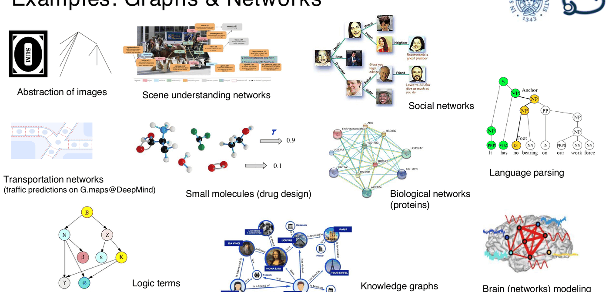
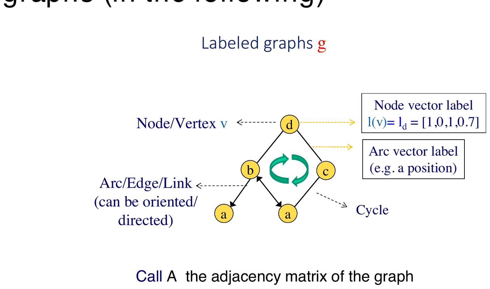
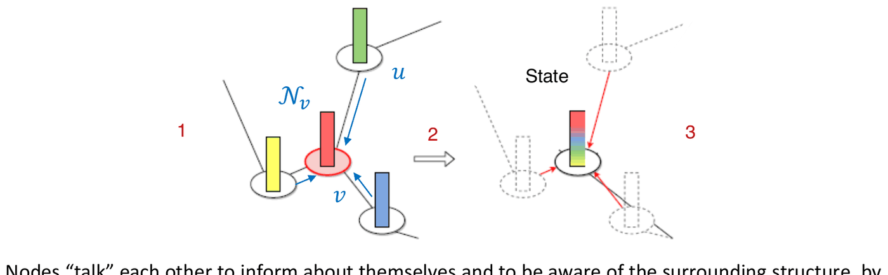
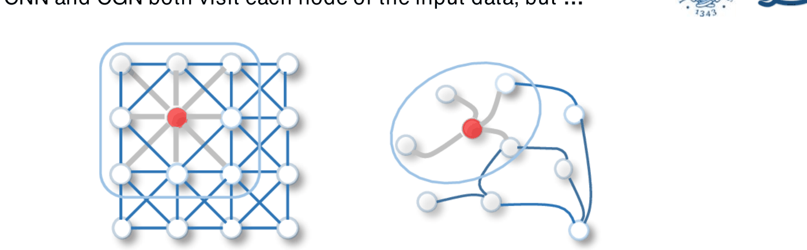
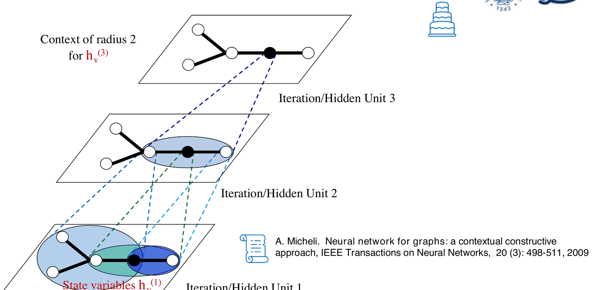
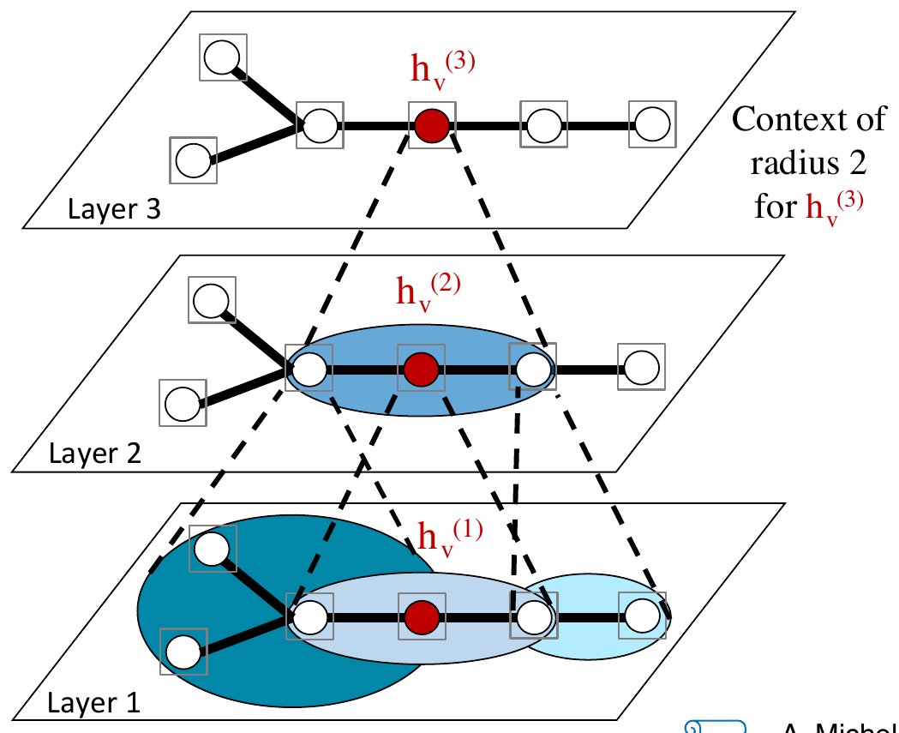
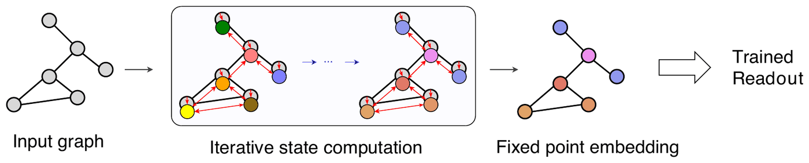
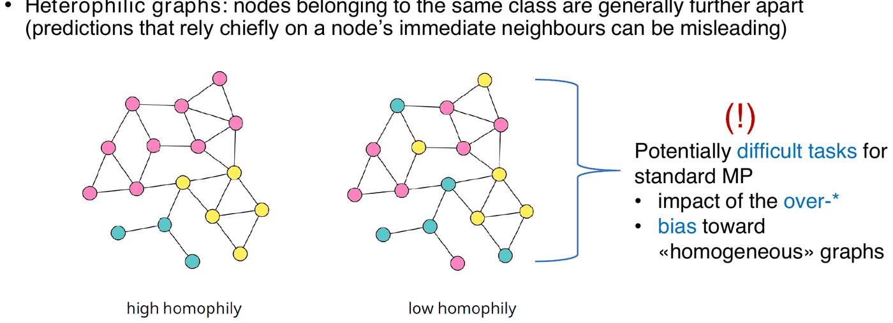
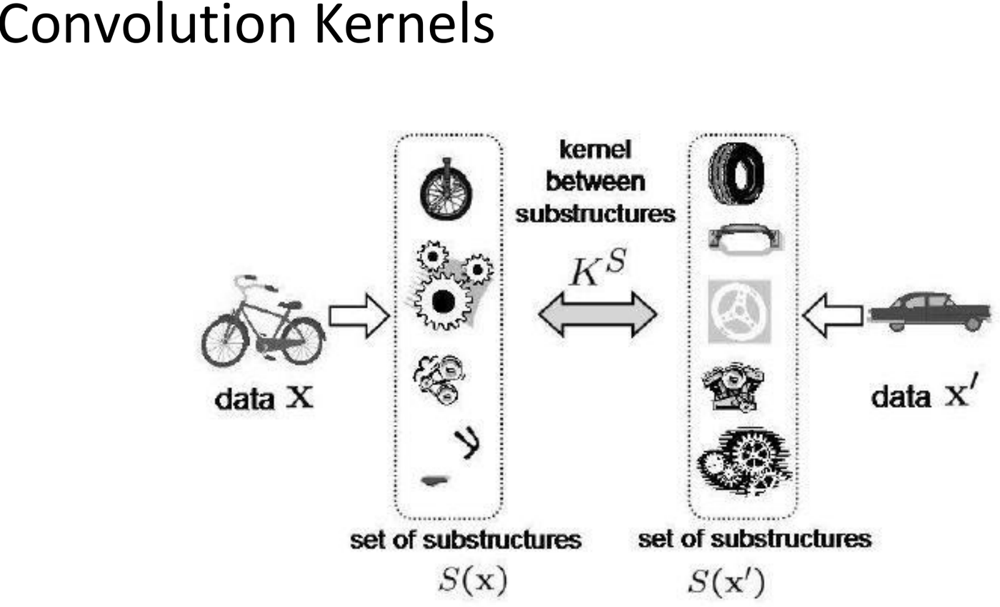

# Apprendimento su dati strutturati e grafi

*Appunti di Fabio Piscitelli — Machine Learning (654AA), Prof. Alessio Micheli, Università di Pisa, a.a. 2024/25*

L'ultima lezione del corso è un'introduzione avanzata all'**apprendimento in domini strutturati** (SD, *Structured Domains*) e in particolare all'**apprendimento su grafi** con le **Deep Graph Networks** (DGN). È anche una panoramica delle ricerche del gruppo CIML di Pisa, che ha contribuito in modo pionieristico a questo campo. Le domande guida: si può fare deep learning sui grafi in modo **efficiente** (senza un addestramento completamente *end-to-end*)? La **profondità** nelle DGN serve, ma causa problemi: perché? Qual è il rapporto tra profondità dei modelli e difficoltà di addestramento?

## Perché dati strutturati e grafi

**Perché i dati hanno relazioni.** Esempi di grafi e reti:

- astrazioni di immagini e reti per la comprensione di scene;
- **social network**, **knowledge graph**;
- analisi sintattica del linguaggio (alberi di parsing);
- reti di trasporto (ad esempio la previsione del traffico su Google Maps, di DeepMind);
- **piccole molecole** (drug design), reti biologiche (proteine);
- termini logici, modellazione di reti cerebrali.

*Fig. 21.1 — Esempi di grafi e reti in domini diversi.*

### Lo scenario

*Fig. 21.2 — Lo scenario: dal dominio di input piatto a quello strutturato, da modelli superficiali a profondi, dall'addestramento end-to-end a quello randomizzato o incrementale. L'obiettivo è ottenere approcci "profondi ed efficienti" per i dati strutturati.*

Il corso ha seguito questa progressione: dai **vettori** (reti feedforward) alle **sequenze** (RNN) alle **strutture** (alberi, grafi). Gli approcci profondi e "larghi" (*deep and wide*) rappresentano l'input su più livelli di astrazione ma hanno un alto costo computazionale; le reti **randomizzate** o **incrementali** offrono l'efficienza.

### Un po' di storia

Le reti neurali per dati strutturati hanno una storia in gran parte **italiana**:

- dalla fine degli anni '90, le **reti neurali ricorsive** per alberi e grafi aciclici orientati (Sperduti, Starita, Frasconi, Gori, Hammer, Micheli, Bianchini, Scarselli, Hagenbuchner...): reti ricorsive (1997–2000), Cascade Correlation per strutture, SOM per strutture (2003–2005), Hidden Tree Markov Model bottom-up (2012), Tree ESN e reservoir computing profondo per alberi (2010–2018);
- l'estensione ai **grafi generali**, pionieristica tra Pisa e Siena (2005–2009), con due approcci:
  1. **ricorsivi**: **GNN** (Scarselli et al., 2009) e **GraphESN** (Gallicchio, Micheli, 2010);
  2. **a strati / convoluzionali**: **NN4G** (Micheli, 2009) in versione costruttiva, poi proseguito come reti convoluzionali per grafi (GCN, ecc.).

Dal 2015 è un'area in **esplosione** a livello mondiale, con decine di articoli in tutte le principali conferenze e applicazioni reali, sotto nomi diversi: *Graph Representation Learning*, *learning on graphs*, *deep learning for graphs*, *Graph Neural Networks* (GNN), *Graph Convolutional Networks* (GCN), e il quadro delle **Deep Graph Networks** (DGN; Bacciu, Errica, Micheli, Podda, 2020).

---

## Deep Graph Networks

### I grafi considerati

Si considerano **grafi etichettati**: ogni **nodo** (vertice) $v$ ha un'**etichetta vettoriale** $\mathbf{l}(v)$ (es. $[1, 0, 1, 0{,}7]$), ogni **arco** (link) può avere un'etichetta (es. una posizione) e può essere orientato; possono esserci **cicli**. $A$ è la **matrice di adiacenza** del grafo.

*Fig. 21.3 — Un grafo etichettato: etichette vettoriali su nodi e archi, possibili cicli.*

### Il problema della rappresentazione

Non esisteva un modo **sistematico** (valido per qualunque task) per estrarre feature o metriche di relazione tra esempi strutturati. È un'istanza del **representation learning**, estesa ai domini strutturati.

- Le rappresentazioni basate su **feature** sono incomplete o fortemente dipendenti dal task (ad esempio gli indici topologici in chimica).
- Le rappresentazioni con **matrici di adiacenza** o altre rappresentazioni di dimensione fissa hanno problemi: sovra-dimensionamento o incompletezza (spreco con il padding o perdita di informazione), **allineamento** tra grafi diversi (quale nodo di un grafo corrisponde a quale dell'altro?), ordine topologico (che rende difficile la generalizzazione).

> [!tip] Muovere i modelli verso i dati
>
> *"La capacità di trattare la natura propria dei dati di input è la chiave per un'applicazione di successo delle metodologie di ML."* Invece di **portare i dati ai modelli** (trasformare grafi in vettori o alberi in sequenze, con problemi di allineamento e perdita di informazione), si **portano i modelli ai dati**.

> [!example] Molecole e trasduzioni
>
> Nel **QSPR/QSAR** si vuole correlare la struttura chimica delle molecole con le loro proprietà: $\text{Proprietà/Attività} = T(\text{Struttura})$, un valore di proprietà (regressione) o "tossico sì/no" (classificazione). Le molecole **non sono vettori**: sono rappresentate più naturalmente da strutture di dimensione variabile. Si può predire direttamente dalle strutture?

### Trasduzioni su grafi

L'obiettivo è apprendere una **trasduzione** $T$ da un dominio strutturato a uno spazio discreto o continuo, a partire da esempi $(\text{grafo}_i, \text{target}_i)$ con grafi di dimensione variabile.

*Fig. 21.4 — Trasduzioni su grafi: il grafo viene codificato in un embedding dei nodi, da cui si ottengono uscite per nodo o per l'intero grafo.*

- **Struttura → struttura** (isomorfa input-output): compiti **a livello di nodo** (es. classificazione dei nodi).
- **Struttura → scalare/elemento**: compiti **a livello di grafo** (regressione o classificazione di grafi).
- In generale anche non isomorfa; e compiti **sugli archi** (es. *link prediction*).

### Il message passing

Come funziona una DGN? Il concetto astratto è il **message passing**: i nodi "parlano" tra loro, scambiandosi messaggi per informarsi a vicenda e diventare consapevoli della struttura circostante.

1. Ogni nodo calcola un **messaggio**, funzione della propria etichetta, dei vicini $\mathcal{N}_v$ e degli archi tra loro, e lo invia ai vicini.
2. I nodi **aggregano** i messaggi ricevuti con una funzione **invariante per permutazione** (non importa l'ordine in cui arrivano).
3. Ogni nodo **aggiorna** i propri attributi (lo **stato**) combinando i messaggi con i parametri liberi $W$.

*Fig. 21.5 — Il message passing: messaggi dai vicini, aggregazione, aggiornamento dello stato.*

Lo stato non dipende solo dal vicinato locale: **iterando** il message passing, l'informazione si **diffonde** da ogni nodo a tutti gli altri. Infine si può emettere un'uscita **per ogni nodo**, oppure **per l'intero grafo** tramite un'aggregazione invariante per permutazione delle rappresentazioni dei nodi, detta **global pooling** (ad esempio somma o media).

### Il legame con le CNN

Sia le CNN sia le reti convoluzionali per grafi visitano ogni nodo dei dati, ma:

- nella **CNN** il kernel convoluzionale si applica su una **griglia regolare** 2D: si fa una media pesata dei pixel nella finestra, e i vicini di un pixel sono **ordinati** e in **numero fisso**;
- nei **grafi** la CNN non si applica direttamente: i vicini di un vertice sono **non ordinati** e in **numero variabile**. Si limita il campo recettivo ai **vicini**, si usa la **condivisione dei pesi** in modo invariante per permutazione (astraendo da qualunque ordinamento dei nodi), e si estende il vicinato locale tramite la **stratificazione**.

*Fig. 21.6 — Convoluzione su griglia (CNN) e su grafo.*

### La formula generale

Il message passing si itera sugli strati (o iterazioni) $l$:
$$
\mathbf{h}_v^{(l)} = AGG_{W^{(l)}}\Big(\mathbf{L}_v,\; \mathbf{h}_v^{(l-1)},\; \{\mathbf{h}_u^{(l-1)} : u \in \mathcal{N}(v)\}\Big), \qquad l = 1, \dots, L,
$$
dove $AGG$ aggrega (propaga) i messaggi dai vicini $u$ con un operatore **invariante per permutazione** sull'insieme dei vicini (es. una somma) e combinazioni delle attivazioni delle unità, $W$ sono i parametri liberi, $\mathbf{L}_v$ l'etichetta del nodo, e $\mathcal{N}$ è dato dalla matrice di adiacenza $A$. Applicare questo calcolo a ogni nodo corrisponde a una **visita parallela e non ordinata** del grafo a ogni iterazione.

Ci sono molte varianti:

- **GCN** (Kipf, Welling, 2017): $\mathbf{h}^{(l)} = \text{ReLU}\big(\hat{A}\,\mathbf{h}^{(l-1)}W^{(l)}\big)$, con $\hat A$ la matrice di adiacenza normalizzata per grado;
- **GraphConv** (Morris et al., 2019): $\mathbf{h}^{(l)} = f\big(W_1^{(l)}\mathbf{h}^{(l-1)} + W_2^{(l)}A\,\mathbf{h}^{(l-1)}\big)$;
- **GAT** (Veličković et al., 2018): aggregazione basata sull'**attenzione**.

(Molte sono disponibili in *PyTorch Geometric*.)

> [!tip] Perché è rilevante per il deep learning
>
> Le DGN sono **intrinsecamente profonde**: il processo non è locale. Iterando sugli strati, le rappresentazioni latenti dei nodi includono progressivamente l'informazione **contestuale** di nodi sempre più lontani (diffusione).

*Fig. 21.7 — Evoluzione del contesto (composizionale) attraverso le iterazioni: al terzo strato lo stato del nodo ha un contesto di raggio 2.*

### NN4G e GCN: iterazioni come strati

*Fig. 21.8 — GCN e NN4G: ogni iterazione del message passing è un nuovo strato.*

Nelle reti convoluzionali per grafi (GCN, NN4G), **ogni iterazione del message passing è un nuovo strato**, e per ogni nodo il contesto si **compone** attraverso gli strati:

- il **campo recettivo** si estende incrementalmente all'aumentare degli strati;
- la **profondità è funzionale alla crescita del contesto**;
- addestrando il modello si impara **come rappresentare il grafo**: end-to-end per le GCN generali, **strato per strato** (in modo incrementale) per NN4G, con numero di strati automatico e senza problemi di vanishing gradient.

**NN4G** (Micheli, 2009) calcola una variabile di stato per ogni strato e ogni vertice:
$$
h_v^{(1)} = f\left(\sum_{j=0}^{|L_v|}\bar w_{1j}\,L_j(v)\right), \qquad h_v^{(l)} = f\left(\underbrace{\sum_{j=0}^{|L_v|}\bar w_{lj}\,L_j(v)}_{\text{etichetta di } v} + \underbrace{\sum_{j=1}^{l-1}\hat w_{lj}\sum_{u \in \mathcal{N}(v)}h_u^{(j)}}_{\text{contesto dai vicini, da tutti gli strati precedenti}}\right), \quad l = 2, \dots, N.
$$
Non è ricorsivo: ogni strato usa gli stati degli strati **precedenti**. Le unità si aggiungono una alla volta (in stile Cascade Correlation), e le uscite dei vari strati vengono combinate per produrre il risultato sul grafo.

### GNN e GraphESN: approccio ricorsivo

Negli approcci **ricorsivi** (GNN, GraphESN) il processo di diffusione è simile, ma $l$ è il numero di **iterazioni sullo stesso strato** (o strati con pesi condivisi). È un **sistema dinamico**: tipicamente si richiede la **convergenza a un punto fisso**, usato come embedding del grafo, e per questo si vincola la dinamica del message passing a essere **contrattiva**.

- **GNN** (Scarselli et al., 2009): con addestramento dell'embedding.
- **GraphESN** (Gallicchio, Micheli, 2010): estende le Echo State Network: la funzione di message passing **non è addestrata** (è un reservoir casuale), ma si controllano direttamente i parametri del sistema dinamico.

$$
\mathbf{h}_v^{(l)} = \tanh\left(\sum_{j=0}^{|L_v|}\bar w_{lj}\,L_j(v) + \sum_{u \in \mathcal{N}(v)}\hat W\,\mathbf{h}_u^{(l-1)}\right),
$$
iterata fino a convergenza; l'uscita per un grafo si ottiene con un global pooling $X$ e un **readout lineare** addestrato con pseudoinversa o ridge regression: $y(g) = W_{out}\,X(\mathbf{h}(g))$.

*Fig. 21.9 — GraphESN: calcolo iterativo degli stati fino a un embedding a punto fisso, poi readout addestrato.*

---

## Problemi aperti e alcune proposte

*Fig. 21.10 — Problemi aperti nei modelli di apprendimento su grafi: efficienza, under-reaching, espressività.*

### Efficienza: oltre la backpropagation end-to-end

- **GraphESN per la classificazione di nodi**: su grafi molto grandi (es. Twitch-gamers, 168.000 nodi) ottiene un'accuratezza pari o superiore alla maggior parte dei modelli addestrati end-to-end, con un'accelerazione fino a 10 volte, e l'addestramento scala facilmente oltre i 100.000 nodi.
- **NN4G+** (progettazione automatica dell'architettura): la rete si costruisce **incrementalmente**, con una doppia espansione sinergica. Si addestra **un'unità alla volta** (niente backpropagation end-to-end attraverso gli strati); uno strato viene espanso finché l'accuratezza di validazione migliora, e si aggiungono nuovi strati finché migliora. Le architetture ottenute sono adattate al task, costantemente più profonde e snelle rispetto a una ricerca esplicita dell'architettura, e vengono costruite in minuti invece che ore (oltre 10 volte più veloce, senza perdita di accuratezza).

### I problemi della profondità: gli "over-*"

La profondità serve, ma il message passing ha dei bias e dei problemi:

- **Over-smoothing** (Li et al., 2018): l'accuratezza tipicamente cala oltre 4–5 strati; le rappresentazioni dei nodi **collassano** negli strati profondi. Il message passing agisce come una **diffusione**, e le rappresentazioni di alto livello dei nodi diventano tutte simili.
- **Over-squashing** (Alon, Yahav, 2021): è un **collo di bottiglia**. Il campo recettivo cresce **esponenzialmente** con la profondità, ma tutta questa informazione va compressa in un embedding di dimensione fissa per nodo. La **sensibilità** della rappresentazione di un nodo alle feature di input di nodi lontani, misurata dallo Jacobiano $\partial\mathbf{h}_v^{(L)}/\partial\mathbf{x}_u$, decresce esponenzialmente con il numero di strati.
- Per l'addestramento end-to-end, la **difficoltà di retropropagare il gradiente** attraverso molti strati di message passing.

L'interazione tra questi fenomeni è un problema di ricerca aperto. Gli effetti:

1. **Under-reaching**: gli over-* impediscono di avere il campo recettivo necessario per apprendere interazioni tra nodi lontani.
2. **Eterofilia** nella classificazione dei nodi. Nei grafi **omofili** i nodi dello stesso vicinato condividono per lo più la stessa classe; nei grafi **eterofili** i nodi della stessa classe sono generalmente lontani, e le predizioni basate soprattutto sui vicini immediati possono essere fuorvianti. Sono task potenzialmente difficili per il message passing standard, per via degli over-* e del bias verso grafi "omogenei".

*Fig. 21.11 — Grafi ad alta e bassa omofilia: i secondi sono difficili per il message passing standard.*

#### Strumenti per l'analisi

- **Modelli che separano il bias del message passing dai problemi dell'addestramento end-to-end**: NN4G (incrementale, senza propagare il gradiente attraverso gli strati) e GraphESN (nessun addestramento dell'embedding, controllo diretto della norma spettrale $\|W\|$, cioè della costante di Lipschitz della funzione di message passing ricorsiva). Poiché
$$
\left\|\frac{\partial\mathbf{h}_v^{(L)}}{\partial\mathbf{x}_u}\right\| \le \prod_{l=1}^{L}\|W^{(l)}\|\cdot\big(A^L\big)_{u,v},
$$
imporre $\|W\| > 1$ impedisce che la sensibilità rispetto all'input svanisca esponenzialmente (over-squashing).
- **Analisi spettrale** degli strati. La "frequenza" su un grafo è la variabilità del segnale (etichette, embedding) tra nodi vicini. L'**energia di Dirichlet** $E(\mathbf{h}) = \sum_{v}\sum_{u \in \mathcal{N}_v}\|\mathbf{h}_v - \mathbf{h}_u\|^2$ misura quanto il segnale varia sul grafo (visione spaziale) e, tramite la trasformata di Fourier su grafo (ottenuta dalla decomposizione del Laplaciano $L = D - A$), come la "massa" del segnale si distribuisce sullo spettro delle frequenze: un segnale a bassa frequenza (liscio) ha bassa energia. I grafi eterofili hanno segnali ad **alta frequenza**, e i task eterofili richiedono di **preservare le alte frequenze**.

Sul dataset **Chameleon** (una rete di pagine Wikipedia, 2277 nodi, 31.400 archi, omofilia 0,23), una "prova da sforzo" per l'eterofilia, NN4G e GraphESN **preservano meglio l'energia** attraverso gli strati, e mentre l'accuratezza degli altri modelli cala all'aumentare del message passing, la loro no. In un esperimento con 12 strati: GraphESN 73,7%, NN4G 68,3%, GCN 57,8%, GAT 55,0%, GraphConv 33,8%.

### Estensioni in corso

- **Grafi dinamici/temporali**: relazioni o valori dei nodi che evolvono nel tempo (diffusione di infezioni, contenuti sui social, segnali sui nodi). Le **Dynamic Graph Echo State Network** realizzano una convoluzione spazio-temporale con un reservoir multistrato, efficaci quanto le reti temporali per grafi addestrate completamente, ma con un'accelerazione di 100 volte nell'addestramento e 10 nell'inferenza.
- **Generazione di grafi**: apprendere la distribuzione $p(G)$ di un insieme di grafi per campionarne di nuovi (es. generazione di molecole basata su frammenti), utile per equità, robustezza, privacy.
- **Spiegabilità** (XAI) per le reti su grafi: ad esempio identificare gli anelli benzenici che determinano una classificazione, o i frammenti strutturali noti (come l'accettore di Michael) che influenzano l'attivazione del pathway P53 nei dati Tox21.
- **Network quantification**: predire la **prevalenza** delle classi tra i nodi non etichettati invece di classificarli singolarmente (voto, ricerche di mercato, epidemiologia).
- **Bioinformatica**: predire proprietà dinamiche (robustezza, sensitività) di pathway biochimici e reti di interazione proteina-proteina rappresentati come grafi.

---

## Altri approcci: i kernel per strutture

I **metodi kernel** si estendono facilmente a grafi di tipi diversi (sequenze, alberi, grafi orientati o no, ciclici o aciclici), perché basta definire un prodotto scalare $k(x, x') = \langle\phi(x), \phi(x')\rangle$, cioè una **similarità** tra dati di qualsiasi tipo, con un embedding implicito in uno spazio euclideo.

- **Kernel marginalizzati**: la similarità tra due grafi si basa sui cammini di etichette comuni ottenuti con random walk; il kernel è il prodotto scalare dei vettori di conteggio, mediato su tutti i possibili cammini. Il costo scala tipicamente in modo quadratico con la dimensione del grafo.
- **Kernel di convoluzione**: si decompongono gli oggetti in **sotto-strutture** e si definisce il kernel combinando kernel tra le sotto-strutture.

*Fig. 21.12 — Kernel di convoluzione: la similarità tra oggetti si calcola a partire dalla similarità tra le loro sotto-strutture.*

> [!warning] Limiti dei kernel per strutture
>
> - **Efficienza**: il costo è critico, per via della scomposizione in sotto-strutture.
> - **Adattività**: sono metodi guidati dalla conoscenza, con una misura di similarità **fissata prima dell'apprendimento**: la codifica nello spazio delle feature non è appresa. Il vantaggio è poter sfruttare la conoscenza a priori per un problema specifico.
> - Per i domini strutturati **non si conosce l'universalità**: la scelta del kernel è critica, e calcolare un kernel **completo** per grafi è difficile almeno quanto il problema dell'**isomorfismo di grafi**. (Si studiano kernel adattivi.)

---

> [!abstract] Conclusioni
>
> - Si può fare deep learning su dati complessi **in modo efficiente**, senza un addestramento completamente end-to-end: modelli come GraphESN e NN4G costruiscono DGN accurate in modo efficiente e permettono di studiare il bias del message passing.
> - La **profondità** nelle DGN è necessaria (fa crescere il contesto), ma può causare problemi (over-smoothing, over-squashing, difficoltà di addestramento); andare oltre l'end-to-end può aiutare sia per l'efficienza sia per gli over-*.
> - Il ML per dati strutturati e grafi è una realtà concreta, ancora in sviluppo, che offre soluzioni nuove dove le **relazioni** contano. Se i dati hanno relazioni (seriali, gerarchiche, reti), **non conviene usare una rappresentazione piatta**. È anche una grande opportunità per trattare in modo uniforme tipi di dati diversi.

> [!question] Possibili domande d'esame
>
> - Perché trattare i dati strutturati direttamente, invece di trasformarli in vettori?
> - Quali tipi di trasduzione si possono definire sui grafi?
> - Descrivere il message passing e la formula generale delle DGN.
> - Differenza tra approcci a strati (GCN, NN4G) e ricorsivi (GNN, GraphESN).
> - Cosa sono over-smoothing e over-squashing? Cos'è l'eterofilia?
> - Pro e contro dei kernel per strutture.
